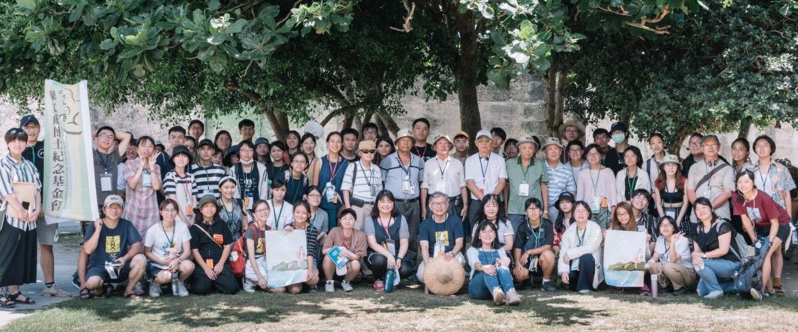
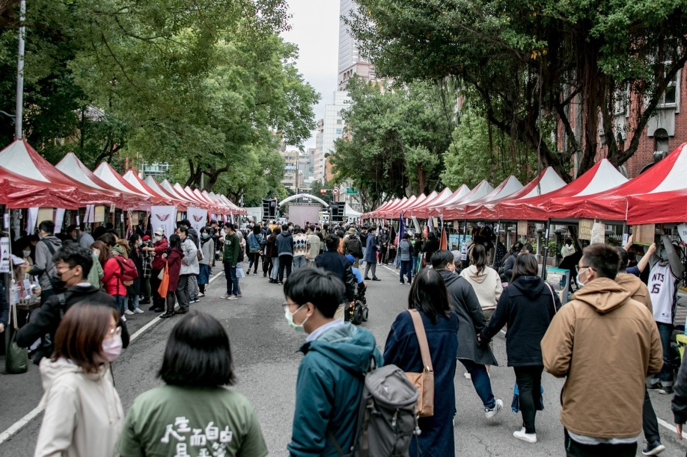
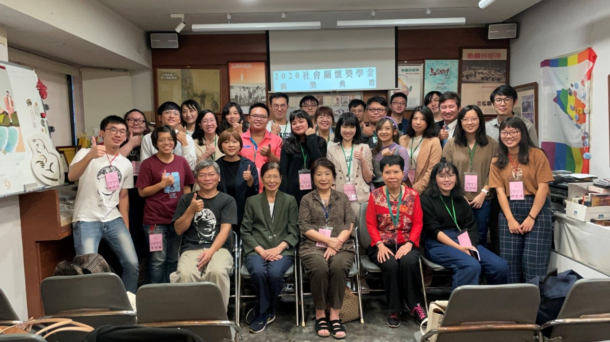

# 陳文成博士紀念基金會

[陳文成](https://zh.wikipedia.org/zh-tw/陳文成)，1950 年出生，台大數學研究所畢業後赴美，取得密西根大學數學博士並任教於卡內基美隆大學。1981 年，自美返台探親，7 月 2 日被警備總部約談，次日陳屍於台大研究生圖書館（即今日的圖資系系館）旁空地。真相至今未明，兇手及主謀者仍逍遙法外。

[基金會](http://www.cwcmf.org.tw/joomla/)延續陳文成的精神，包含追究真相、追求正義、人權的關懷等。藉由出版刊物、舉辦展覽、講座、音樂會、學術研討會、青年歷史營隊，和統計科學獎學金等形式，傳承並發揚其精神。

近年來，在社會各界的努力與關懷下，在台大校園內成立了「[陳文成事件紀念廣場](https://www.ntu.edu.tw/spotlight/2021/1919_20210204.html)」，並於 2021 年 1 月竣工，為台灣校園內轉型正義，樹立了新的里程碑。

期許轉型正義工程，繼續進行，建立台灣成為一個公平正義，進步民主的國家。

 2020 人權之路-綠島青年營

2020 人權辦桌

2020 社會關懷獎學金
