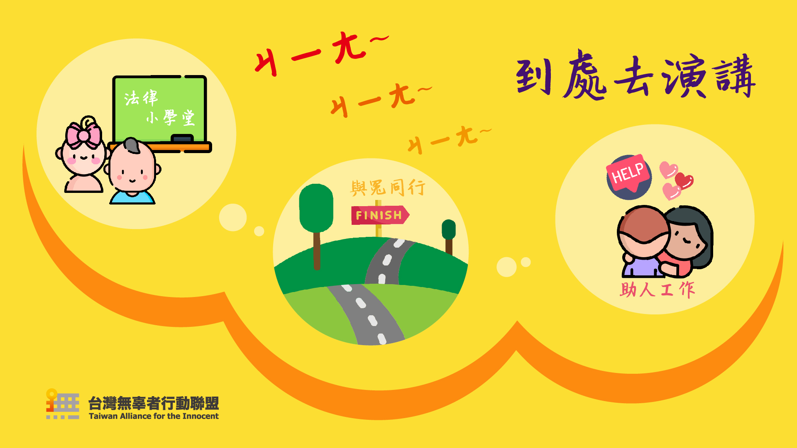
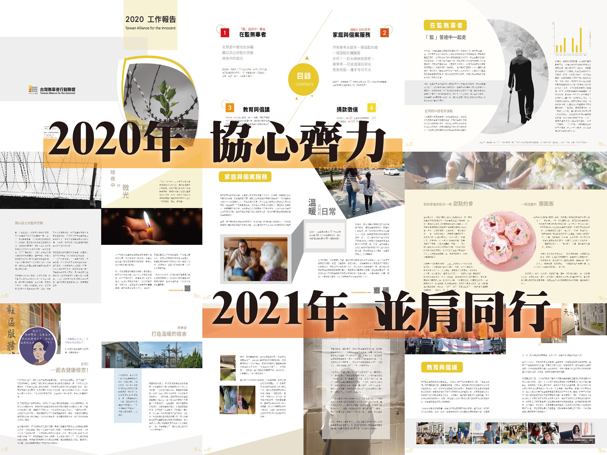

# 台灣無辜者行動聯盟

台灣冤獄平反協會在 2017 年開始，於司法救援外嘗試進行「無辜者關懷」的工作。台灣無辜者行動聯盟正是在面對「無辜者及無辜者家庭成員遇到什麼困難？我們能做些什麼？」的提問與實踐中反省並發現，無辜者關懷工作是需要更全面性關照、串連各界資源來支撐。因此，我們期待透過一個更完整、獨立運作的組織來進行無辜者及家庭成員關懷、陪伴與培力，修復或重建家庭及社會關係，盡可能協助、減少無辜者家庭社會復歸的困境。

我們陪伴無辜者在冤案平反及社會復歸的漫漫長路中前行，試著重建、修復並彌補無辜者及家庭在冤案中所失去的人生缺角。

以「無辜者及家庭」為中心是我們核心理念，透過監所及家庭訪視的理解方能進行支持與陪伴，搭起個人與家庭的橋樑、試著鞏固破碎的家庭關係。

（[截自官網](http://front.all4innocent.tw/index.php/home)）
