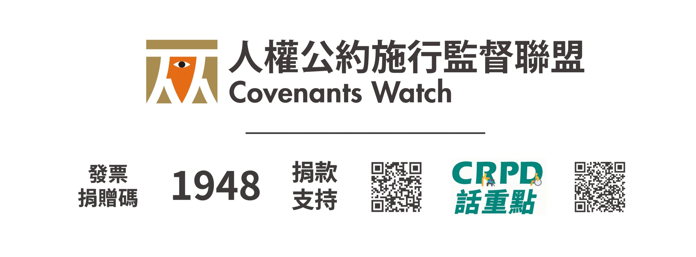
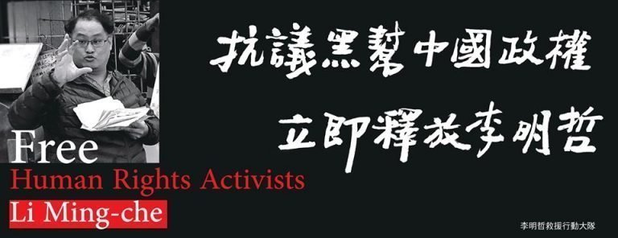

# 人權公約施行監督聯盟

人權公約施行監督聯盟（Covenants Watch，簡稱「人約盟」）是台灣在地的非政府組織，致力推動普世人權價值，確保人人皆享有平等之尊嚴與權利。2009 年 4 月，我國立法院通過《公民與政治權利國際公約及經濟社會文化權利國際公約施行法》，宣告這兩部最重要的聯合國人權公約（簡稱「兩公約」）具有國內法律效力，同時也向全世界宣誓台灣願意遵守人權價值的決心。

然而，長期被國際社會排除在外的政治現實，使得台灣人民對於國際上迅速發展的人權標準相當陌生，就連政府部門也不太熟悉其具體內涵，究竟如何能夠展開這樣巨大的改革工程呢？2009 年 12 月 10 日國際人權日這天，四十多個人權團體、律師與學者專家在民主運動前輩黃文雄先生的召集下，宣布組成「兩公約施行監督聯盟」，致力監督政府落實相應而來的人權義務。

其後，政府又於 2011 年通過《消除對婦女一切形式歧視公約施行法》，2014 年通過《兒童權利公約施行法》及《身心障礙者權利公約施行法》，本聯盟工作範圍亦隨之擴大，遂改其後，政府又於 2011 年通過《消除對婦女一切形式歧視公約施行法》，2014 年通過《兒童權利公約施行法》及《身心障礙者權利公約施行法》，本聯盟工作範圍亦隨之擴大，遂改名為「人權公約施行監督聯盟」，並於 2016 年正式立案，持續不懈地推動台灣人權機制的落實與深化。

（[取自官網](https://covenantswatch.org.tw/)）
