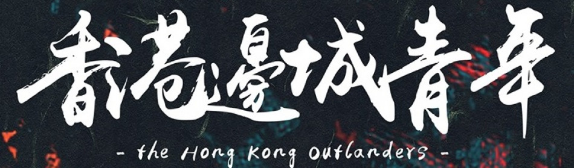
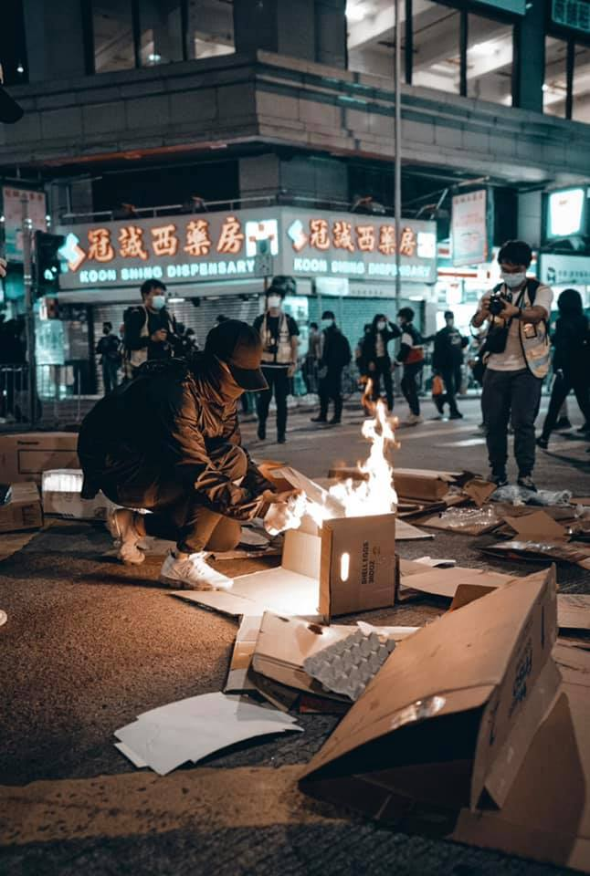
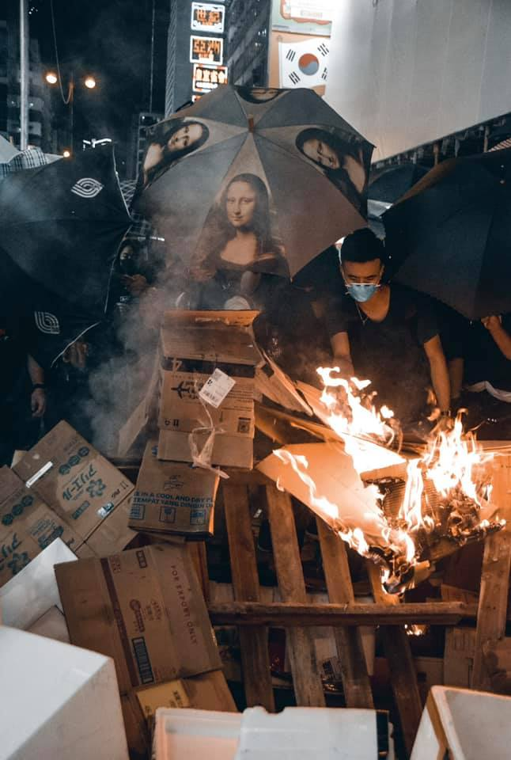

# 香港邊城青年

「洶湧的黑潮有時把長堤沖潰。點滴的流泉有時把磐石滴穿！」—楊華《黑潮集》

楊華名作《黑潮集》，以台灣海峽的「黑潮」命名，象徵著儘管處於洶湧險惡的黑水浪潮，挺立堅定的抗爭意志，可將長堤沖潰，可將磐石滴穿。

原本有著法治和自由的香港，在極權威脅下，遍地催淚瓦斯和橡膠子彈殼，街頭抗爭竟成為香港青少年的日常。香港人民高喊的「五大訴求」，港府回應消極；警察與黑道的暴力，卻得到港府的默許與縱容。這是一場艱辛而漫長的抗爭，苦撐的香港，需要台灣、需要世界各國的支持！

香港邊城青年（英語：Hong Kong Outlanders）於 2019 年 7 月 29 日成立，是一個由在台港人所發起的團體，前身為「在台港生及畢業生逃犯條例關注組」，主要透過聲明、展覽、圖文與行動，持續關心香港的彼時今日，願榮光歸香港。

（[取自官網](http://hkoutlanders.com/)）
