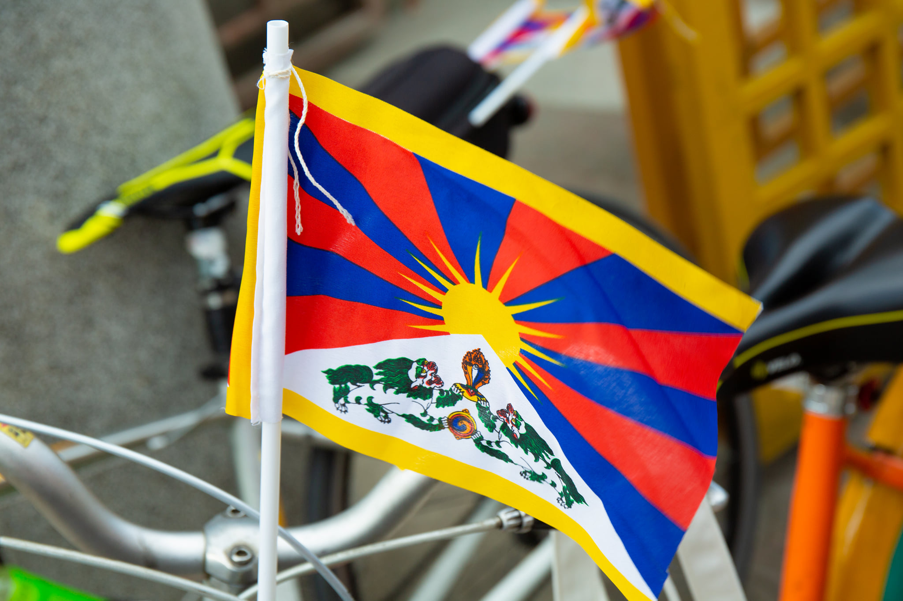
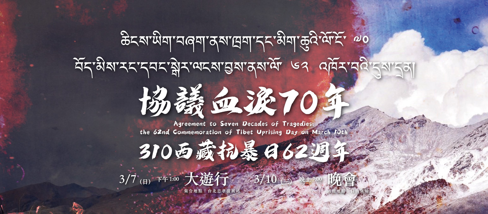

# 西藏台灣人權連線

西藏台灣人權連線成員主要來自台灣不同領域的人權 NGOs，包括西藏人和台灣人，也包括社運工作者、大學教授、作家、學生、立法委員等。藏台連線成員長期關注西藏議題，每年的 310 西藏抗暴日遊行或者當西藏相關人權侵害事件發生時，都會挺身而出進行倡議行動。

台灣原本已有援藏團體及在台藏人團體，努力地為西藏議題發聲；在這個基礎之上，我們成立一個聚焦且同步關切西藏及台灣人權議題的組織，共同為推動藏台人權而努力。

除了 310 西藏抗暴日的辦理，我們也透過國際交流、聲援行動、網站建置自焚者檔案，以及對藏人而言意義重大的 Lhakar 之夜，不只凝聚西藏人權的改善之聲，也為世界各地的人權發聲。

（[取自官網](http://hrntt.org/)）
