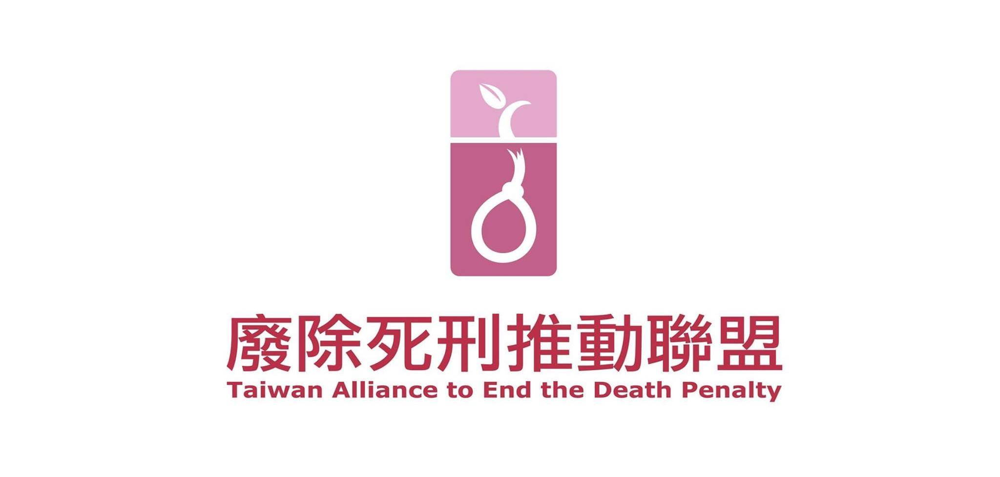
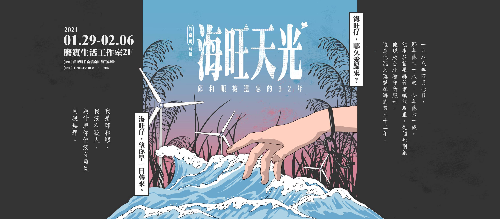
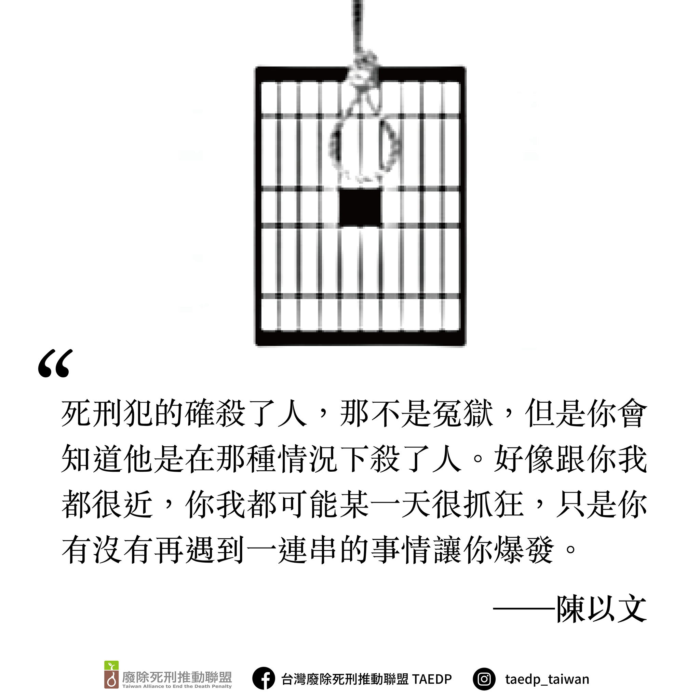

# 台灣廢除死刑推動聯盟

長期參與人權運動、司法改革及死刑冤案救援的民間司法改革基金會、台灣人權促進會、台北律師公會、東吳大學張佛泉人權研究中心等團體，眼見來不及為冤死的江國慶和盧正平反，更有感於為救援蘇建和案、徐自強案當事人與死神拔河的急迫感，決定除了個案救援，更應該從制度上改革，才能避免無辜的人民繼續枉死，阻止國家繼續使用死刑這個暴力手段，因此在 2003 年邀集更多團體和個人，成立以推動廢除死刑為終極目標的民間聯盟，成立之初以「替代死刑聯盟」為名，後於 2006 年正式更名為「台灣廢除死刑推動聯盟」。

主要目標是希望能從制度上改革以避免無辜的人繼續枉死，也想要阻擋國家繼續使用死刑這個暴力手段。人人都希望生活在一個安全的社會，但死刑並非解決方案；唯有探究犯罪背後的成因，努力消除社會歧視與不公平，才能真正減少犯罪。期待有一天台灣能成為一個沒有死刑的國家。

（[取自官網](https://www.taedp.org.tw/)）
