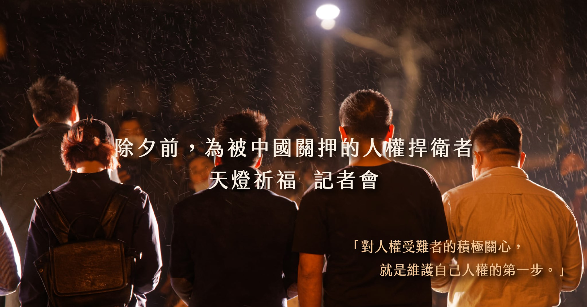
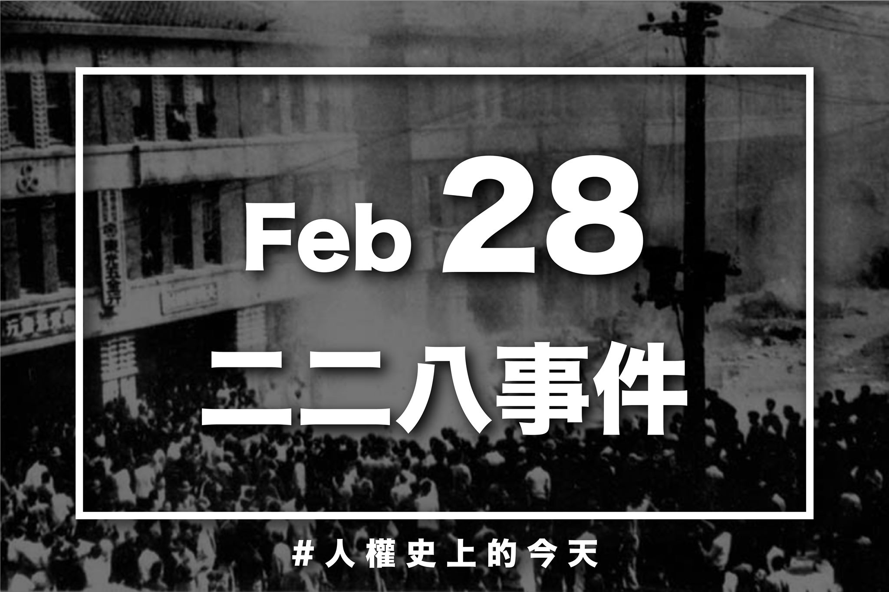
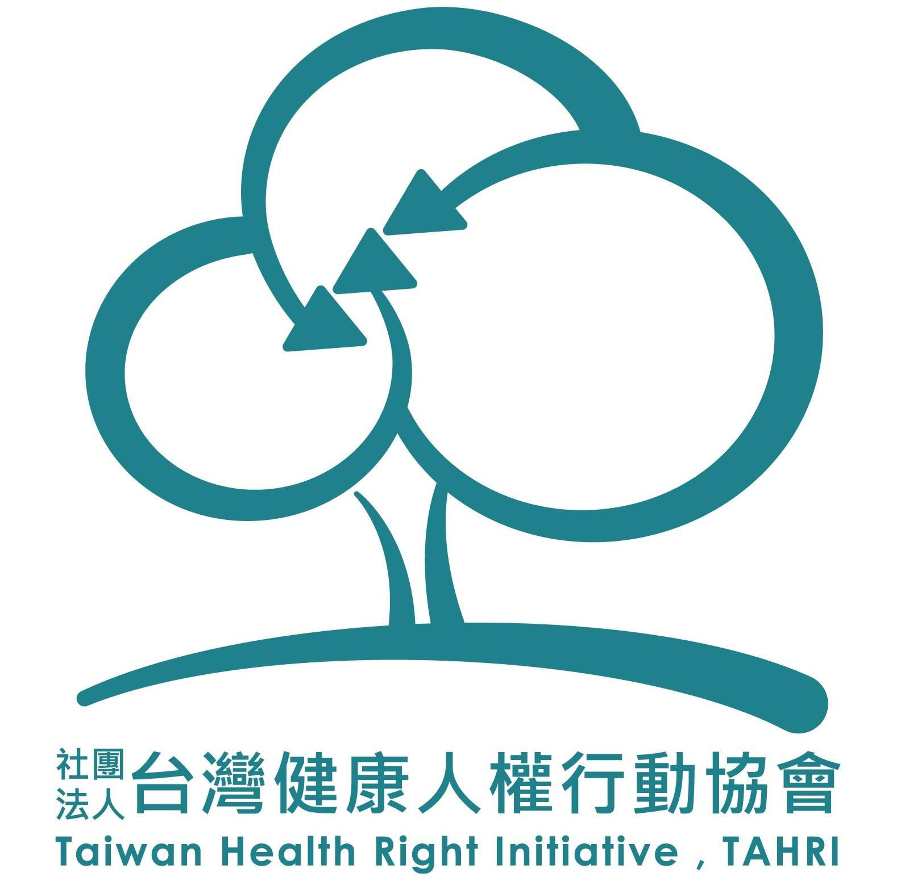

# 台灣人權促進會

台灣人權促進會成立於戒嚴時期的 1984 年 12 月 10 日（國際人權日）。台灣因長期戒嚴，未能落實基本人權保障。成立初期，我們以推動民主改革，確保各項政治與公民權利為要務。

台權會曾救援、聲援蘇建和三人案及邱和順案等重大刑事司法冤案，提供訴訟協助，並舉辦巡迴演講、法庭觀察，也曾針對政府長期以來對於樂生院漢生病患之錯誤政策、烏來原住民遭新北市政府拆碑等事件，參與行政訴訟，透過記者會、投書等方式，要求政府改正。近年來，台權會也對於迫遷、難民、無國籍等個案，參與聲援、倡議相關法令制度之改善

除了參與個案協助，台權會亦從事法案研究與倡議、居住權和「網路自由與隱私」議題、人權專書與多媒體教材之翻譯、製作及出版，也參與國際人權組織，交換經驗、相互支援。

（取自官網）

# 基本資訊

