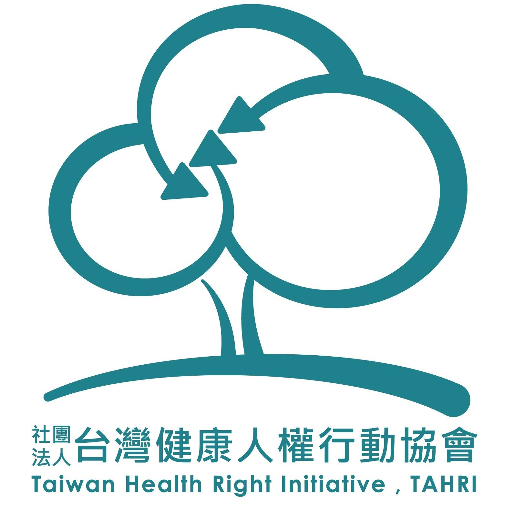

# 臺灣健康人權行動協會

「台灣健康人權行動」（Taiwan Health Right Initiative, TAHRI）是由一群來自社會運動團體、學術界及醫療實務工作者共同組成的非營利組織，已於 2015 年 1 月 17 日完成立案，並登記為社團法人。這是一個致力於消弭因環境、經濟、地域、族群、性別、貧窮、居住、教育、職業等因素所造成的健康不平等、積極投入台灣健康人權行動工作的新組織，以促進社會平等、落實健康基本人權為宗旨。

健康人權（right to health）作為新興人權，近來廣受學界與實務界之重視，並已成為各國社會普遍關注之重要人權；為確保人民健康能獲得最高可得程度（highest attainable standard of health）之保障，各國政府無不透過社會福利、社會保險及公共衛生政策等不同公共政策之介入，提升國民健康人權之尊重、實踐與保障（respect, fulfillment, and protection），包括基本健康（minimal health）促進、健康不平等消弭、基本藥物近用等。但不可否認，健康人權涉及資源耗用之權利特性，亦使國家實踐健康人權之義務內涵，屢受挑戰與質疑。

我們透過設置網站的方式擴大社會接觸，提供健康不平等之相關資訊，包括：國、內外統計資料、重要書籍導讀及文獻推薦；針對健康不平等之面向定期訪談專家學者及實務工作者，並以舉辦論壇之方式豐富國內對此議題的論述和討論，進而推動跨領域合作推動相關政策。

（[取自官網](http://www.tahri.org.tw/）

# 基本資訊

