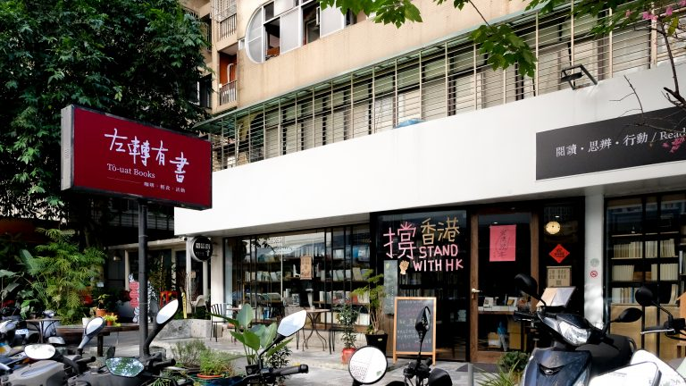

# 再見慕哲

> 2021 年 2 月 9 日 by [touat431]()

發現我們招牌換了嗎？我們也即將更改臉書粉專名稱為【左轉有書 TouatBooks】囉！

為什麼不再使用「慕哲咖啡」？

> –你們究竟是咖啡店還是書店？這幾年三不五時我們都會聽到這個問題。

2016 年，20 個來自 NGO 的工作者合資成立了「左轉文化股份有限公司」準備在城市裡開一間社運議題的主題書店。在尋找場地空間時，因緣巧合之下我們頂下了當時位於紹興北街的「慕哲咖啡館」，並在原來的空間裡增加了「左轉有書」這個搞獨立的書店。

經營四年多來，許多人對於我們店的定位感到混淆，再三評估之下，同時也是因為疫情所迫而面臨轉型之際，我們最後決定未來將只使用「左轉有書」來當我們的店名，給左轉 3.0 一個更明確的定位：就是一間**複合式的書店**！

其實只是名稱變了，但是咖啡、輕食、場地等等的服務項目都一樣會有喔！

啊，還有一樣變了，就是我們將來會更著重在活動的舉辦，並且透過網路直播/轉播的方式，讓更多不在台北的朋友也可以聽到這一場場精彩的講座！

左轉 3.0 希望有您參與，歡迎大家用訂閱我們書店的方式一起參與社會運動！

▸▸▸ [更多詳情](https://bit.ly/3izu1ED)

