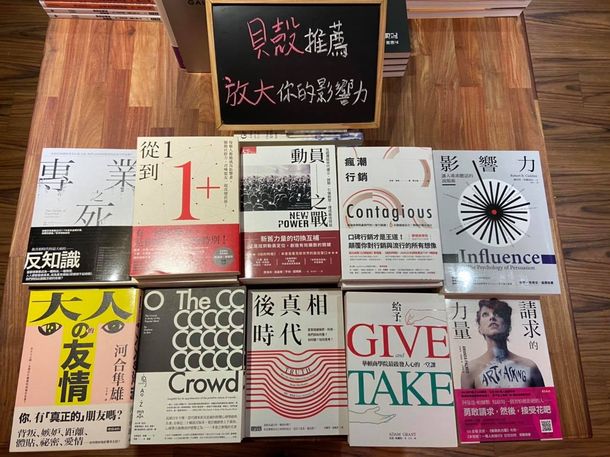

# 社運如何發起群眾集資 - 林大涵

## 基本資訊

-   主辦單位: [左轉有書 TouatBooks](https://touat.com.tw/)
-   講者: [林大涵](./speaker.md) / 貝殼放大股份有限公司執行長暨創辦人
-   時間：2020 年 12 月 29 日 19:00-21:00
-   地點: [左轉有書](./venue.md)
-   住址：台北市鎮江街 3-1 號 ([地圖](https://goo.gl/maps/qsFpaJSnDBoQKrQV9))
-   費用：免費
-   報名方式：需事先填寫[報名表](https://forms.gle/G3H8kLezCWZn382y8)

# 活動簡介

2020 年是辛苦的一年，各行各業都是。對於許多 NGO 來講，原本已經很困難的募款工作今年更是艱辛，除了原本募款、申請計畫補助的方式之外，近年興起的群眾集資也開始成為許多組織正在考慮的行動。但是沒有具體的「商品」該如何做群募呢？「理念」可以成為「商品」嗎，還是得要製作「義賣品」才能做集資呢？而非營利組織的群募算是募款嗎？在法規上是否會有問題呢？

群眾集資是與社會對話一個很重要的形式。左轉有書很榮幸邀請到[貝殼放大](https://www.backer-founder.com/)創辦人[林大涵](.\speaker.md)來跟大家談談社運的群眾集資如何可能，現場為大家解答困惑、互相激盪，機會非常難得，歡迎 NGO 的夥伴們免費參加！

.

# 講者介紹

## # 林大涵

現職：貝殼放大股份有限公司執行長暨創辦人

自 2011 年起開始參與群眾集資產業，參與超過 600 件專案，橫跨科技、設計、社會、創作、公益等領域。2014 年成立貝殼放大，目前累積輔導的集資專案金額已超過 20 億元，提供包含市場調查、策略制定、文案視覺製作、廣告投放與媒體公關操作等服務，協助超過 300 個團隊實踐夢想的第一步，解決執行過程中的各種問題和需求。

貝殼放大保持 95% 以上的集資成功率，平均單案募集金額超過 600 萬元，其中有超過 64 件破千萬案件。是台灣第一間、也是規模最完整的群眾集資顧問公司。

2015 年《經理人月刊》頒發 2015 年度臺灣 MVP 經理人，2016 年獲《富比士（福布斯）》雜誌選為 30 under 30 asia、《Taiwan Tatler》雜誌選為 Generation T、《Prestige》雜誌選為 40 under 40、2017 年獲 《GQ》雜誌選為 Men of the Year Next wave.

.

# 相關資訊

-   活動網站: [臉書活動](https://www.facebook.com/events/1118201605354787)
-   活動轉播: [臉書轉播](https://www.facebook.com/1143105075726336/videos/703855667186006)
-   活動記錄: [Youtube](https://www.youtube.com/channel/UCcQZnZ3y5ZgV3q1fs7eugfw)

## 相關活動

## 延伸閱讀

-   [專業之死](https://www.thenewslens.com/article/105503)
-   [從 1 到 1+](https://rate0625.pixnet.net/blog/post/475530017-%E3%80%90%E5%95%86%E6%A5%AD%E3%80%91%E5%BE%9E1%E5%88%B01%2B)
-   [動員之戰](https://scd156.pixnet.net/blog/post/351706231-%5B%E8%AE%80%E6%9B%B8%E5%BF%83%E5%BE%97%5D-%E5%8B%95%E5%93%A1%E4%B9%8B%E6%88%B0%EF%BD%9C%E5%9C%A8%E8%B6%85%E9%80%A3%E7%B5%90%E4%B8%96%E4%BB%A3%E5%BB%BA%E7%AB%8B%E3%80%81%E8%AA%AA)
-   [瘋潮行銷](https://www.bnext.com.tw/article/28290/BN-ARTICLE-28290)
-   [影響力](https://happyread.medium.com/35-%E8%AE%80%E6%9B%B8%E5%BF%83%E5%BE%97-%E5%BD%B1%E9%9F%BF%E5%8A%9B-%E8%AE%93%E4%BA%BA%E4%B9%96%E4%B9%96%E8%81%BD%E8%A9%B1%E7%9A%84%E8%AA%AA%E6%9C%8D%E8%A1%93-ce4f9bdb111f)
-   [大人の友情](https://www.linkedin.com/pulse/%E6%9C%89%E9%87%97%E4%B8%80%E6%97%A5%E5%A4%A7%E4%BA%BA%E3%81%AE%E5%8F%8B%E6%83%85%E6%98%AF%E7%A4%BE%E4%BA%A4%E8%B7%9D%E9%9B%A2%E7%9A%84%E9%AB%94%E7%8F%BE-cathy-hung/)
-   [烏合之眾](https://www.eslite.com/product/1001130572566513)
-   [後真相時代](https://www.eslite.com/product/1001119732685858)
-   [給予](https://juleshenri717.pixnet.net/blog/post/352800089)
-   [請求的力量](https://www.thenewslens.com/article/35073)

## 其他事項

-   座位有限，額滿為止
-   配合秋冬防疫專案入場務必戴口罩
